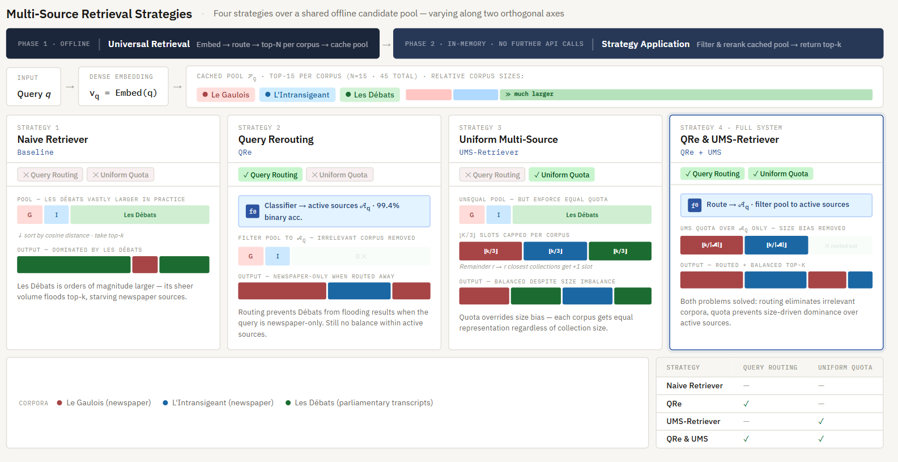
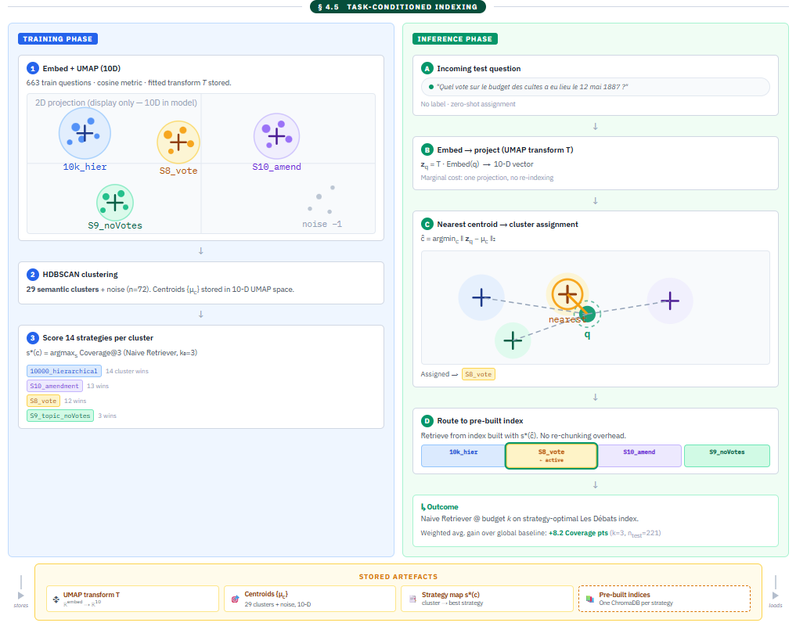
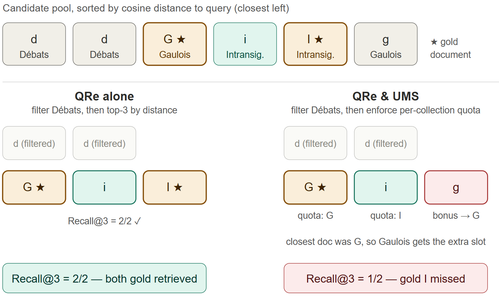

<div align="center">

# ORDER: Task-Conditioned Routing for Retrieval-Augmented Generation

**O**ptimal **R**outing for **D**ynamic **E**vidence **R**etrieval — a query-conditioned router that picks per-cluster chunking, metadata, and source policies, turning a one-size-fits-all RAG into a multi-source, multi-strategy retriever.

[](https://2026.emnlp.org/)
[](https://www.python.org/)
[](#license--acknowledgements)
[](https://www.trychroma.com/)
[](https://docs.cohere.com/)
[](https://anonymous.4open.science/r/ORDER_EMNLP2026-BEC6/README.md)

<p align="center">
  <br/>
  <em>Figure 1 — ORDER as three switches flipped per query at inference. <strong>Offline</strong> (top, conditioned on the document, done once): training questions are embedded and reduced with UMAP, clustered with HDBSCAN, and every cluster scores its 14 chunkings, 14 metadata strategies, and 2 source-routing modes by Coverage@k<sub>0</sub>; the winning <em>(chunk, meta, src)</em> triple is stored in a persistent lookup s*(c) and the matching ChromaDB index is built once. <strong>Online</strong> (bottom, conditioned on the query, per-request): the query is embedded, projected through the saved UMAP transform, assigned to its nearest centroid, and s*(ĉ) prescribes which pre-built index, which metadata filter/reranker, and which active source set to use. Standard RAG (dashed grey arrow) flips none of the three switches and serves every query from the same biased top-k.</em>
</p>

</div>

> This repository is anonymised for EMNLP 2026 double-blind review. Please do not attempt to identify the authors. The code mirror is hosted at [anonymous.4open.science/r/ORDER_EMNLP2026-BEC6](https://anonymous.4open.science/r/ORDER_EMNLP2026-BEC6/README.md).

---

## Abstract

Retrieval-Augmented Generation (RAG) pipelines typically rely on a fixed indexing and retrieval configuration determined at preprocessing time. This one-size-fits-all design is ill-suited to domain-expert settings, where heterogeneous queries require different chunking granularities, metadata constraints, and source-selection strategies — so a configuration that works for one family of queries underperforms on another.

We introduce **ORDER** (Optimal Routing for Dynamic Evidence Retrieval), a query-conditioned RAG framework that jointly adapts **indexing** and **retrieval** to the incoming query. Offline, ORDER discovers semantic clusters over the training questions of a corpus and learns, per cluster, a chunking strategy together with a suited metadata filter/reranker; at inference, queries are routed to the appropriate pre-built index through nearest-centroid assignment. On top of this, a supervised **Query Rerouter (QRe)** predicts which collections are likely to contain relevant evidence, and a **Uniform Multi-source Sampler (UMS)** allocates the retrieval budget evenly across the selected sources.

Evaluated on the 1887 slice of HistoriQA-ThirdRepublic — three heavily imbalanced French historical sources (parliamentary transcripts + two opposing newspapers) — ORDER's full pipeline reaches **Recall@3 of 52.3** on multi-hop questions vs. 35.9 for the Naïve dense retriever, +16.4 pp over the strongest dense baseline and +20.6 pp over HippoRAGv2. QRe and UMS attack structurally distinct failure modes (source contamination vs. source starvation) and compose strictly; task-conditioned chunking and metadata add up to **+8.9 pp Coverage@3** under the Naïve Retriever, and TC-Metadata persists (+6.0 pp Cov@3) once the more sophisticated UMS retriever is active.

---

## Overview

RAG pipelines typically treat every query the same way: one chunking strategy, one metadata index, one retriever, one source pool. On heterogeneous, size-imbalanced corpora this fails twice: long-form sources contaminate the top-k for queries that should never touch them, while small sources are starved by the dominant index.

ORDER replaces the one-size-fits-all assumption with a task-conditioned router that flips three switches per query:

1. **Which chunking granularity?** — TC-Chunking (C2)
2. **Which metadata filter / rerank?** — TC-Metadata (C3) (and the joint C × M variant, deferred to the appendix)
3. **Which source(s), and in what proportion?** — QRe + UMS (the "Structured Retriever", S-RAG)

All four mechanisms share one offline footprint: a UMAP-10D + HDBSCAN cluster map learned over training-question embeddings, plus per-cluster strategy scores. At inference the query is embedded, projected, assigned to its nearest centroid, and served from the index/policy that cluster prefers.

Key properties:

- **Task-conditioned indexing.** Each semantic cluster of queries gets its own chunking strategy, metadata policy, or joint pair, with no per-query re-indexing. All 14 (or 14 × 14 = 196) configurations are built once, offline, and selected at inference by nearest-centroid lookup.
- **Query Rerouter (QRe).** A logistic classifier on Cohere `embed-v4.0` question embeddings separates press-only from parliamentary-touching queries (99.4 % accuracy on held-out queries).
- **Uniform Multi-source Sampler (UMS).** Distributes the top-k budget evenly across active sources to mitigate source starvation. Composes with QRe.
- **Multi-hop retrieval.** Recall@3 of **52.3** on the HistoriQA-ThirdRepublic multi-hop set, vs. 35.9 for the Naïve dense retriever, 31.7 for HippoRAGv2 and 18.2 for LinearRAG with the same Cohere embeddings.
- **Reproducible.** 5 seeds (`[42, 123, 2021, 7, 9999]`), Bonferroni paired *t*-tests, 50/50 train/test split (n<sub>train</sub>=437, n<sub>test</sub>=438 per seed), end-to-end pipeline in seven `python -m ...` commands.

QRe and UMS target structurally distinct failure modes — source contamination vs. source starvation — and compose without overlap.

---

## Table of contents

1. [Framework overview](#framework-overview)
2. [Research questions](#research-questions)
3. [Results from the paper](#results-from-the-paper)
4. [The four mechanisms in detail](#the-four-mechanisms-in-detail)
5. [Dataset: HistoriQA-ThirdRepublic](#dataset-historiqa-thirdrepublic)
6. [Repository layout](#repository-layout)
7. [Setup](#setup)
8. [End-to-end reproduction](#end-to-end-reproduction)
9. [Notebook walkthroughs](#notebook-walkthroughs)
10. [Paper ↔ code mapping](#paper--code-mapping)
11. [Limitations](#limitations)
12. [Citation](#citation)
13. [License & acknowledgements](#license--acknowledgements)

---

## Framework overview

ORDER splits retrieval optimisation along two axes:

| Phase                  | Cost     | What ORDER does                                                                                                                                                            |
| ---------------------- | -------- | -------------------------------------------------------------------------------------------------------------------------------------------------------------------------- |
| **Offline** (once)     | Heavy    | Build 14 chunkings of *Les Débats*; embed each into ChromaDB (Cohere `embed-v4.0`); cluster training questions; score every (cluster × strategy) pair; train QRe classifier. |
| **Online** (per-query) | Light    | 1 embedding call → 1 UMAP projection → 1 nearest-centroid lookup → 1 classifier prediction → retrieve from the chosen index with the chosen metadata policy and source mix. |

<p align="center">
  <br/>
  <em>Figure 2 — Task-conditioned indexing pipeline in detail. <strong>Left (training, blue):</strong> 663 training questions are embedded with Cohere <code>embed-v4.0</code>, reduced to 10D with UMAP under cosine distance, and clustered with HDBSCAN, yielding ~29 semantic clusters plus a noise group (n=72); centroids {μ<sub>c</sub>} are stored in the 10D UMAP space. Each cluster then scores all 14 chunking strategies by Coverage@3 with the Naïve Retriever; winners per cluster (here <code>10000_hier</code>, <code>S10_amendment</code>, <code>S8_vote</code>, <code>S9_topic_noVotes</code>, …) are recorded as the strategy map s*(c). <strong>Right (inference, green):</strong> an incoming test question ("Quel vote sur le budget des cultes a eu lieu le 12 mai 1887 ?") is embedded, projected through the saved UMAP transform, and assigned to its nearest centroid (here <code>S8_vote</code>). The query is then routed to the corresponding pre-built ChromaDB index and served with no re-chunking overhead. <strong>Bottom artefacts:</strong> the only four things persisted across the offline→online boundary are the UMAP transform T, the centroids {μ<sub>c</sub>}, the strategy map s*, and the pre-built indices (one per chunking strategy). Weighted-average gain over the global baseline: <strong>+8.2 Coverage points at k=3</strong> on the held-out set.</em>
</p>

### Inference algorithm (paper Algorithm 1)

```
Input: query q, UMAP transform T, centroids {μ_c}, strategy map s*(·), budget k
1. z_q  ← T( embed(q) )                       # one UMAP projection
2. ĉ    ← argmin_c  ‖z_q − μ_c‖₂              # one nearest-centroid lookup
3. cfg  ← s*(ĉ)                               # cluster's chunking / metadata / source policy
4. return Retrieve(q, cfg, k)
```

The same template instantiates **C2** (𝒮 = 14 chunkings), **C3** (𝒮 = 14 metadata strategies), and the appendix-only **C4** (𝒮 = 𝒮<sub>chunk</sub> × 𝒮<sub>meta</sub>, 196 pairs).

---

## Research questions

The paper is organised around four questions (paper §5); this repo provides one runnable artefact per RQ.

| RQ      | Question                                                                                              | Reproduced by                                                                                                       |
| ------- | ----------------------------------------------------------------------------------------------------- | ------------------------------------------------------------------------------------------------------------------- |
| **RQ1** | Does query-conditioned **source selection** beat a single-index baseline?                             | **Analysis notebook:** [notebooks/32_retriever_evaluation_query_rerouting.ipynb](notebooks/32_retriever_evaluation_query_rerouting.ipynb) |
| **RQ2** | Are **QRe** (router) and **UMS** (allocator) complementary remedies for size-imbalanced retrieval?    | **Analysis notebook:** [notebooks/32_retriever_evaluation_query_rerouting.ipynb](notebooks/32_retriever_evaluation_query_rerouting.ipynb) |
| **RQ3** | Does query-conditioned **chunking** beat a global best?                                               | [scripts/run_C2_multiseed_kfold.py](scripts/run_C2_multiseed_kfold.py) · analysis: [notebooks/single_seed/40_C2_task_conditioned_chunking.ipynb](notebooks/single_seed/40_C2_task_conditioned_chunking.ipynb) |
| **RQ4** | Does query-conditioned **metadata indexing** on *Les Débats* beat a uniform global baseline?          | [scripts/run_C3_multiseed_kfold.py](scripts/run_C3_multiseed_kfold.py) · analysis: [notebooks/single_seed/41_C3_task_conditioned_metadata.ipynb](notebooks/single_seed/41_C3_task_conditioned_metadata.ipynb) |
| *App. I* | Does **joint** optimisation of chunking × metadata beat either single axis?                          | [scripts/run_C4_joint_multiseed.py](scripts/run_C4_joint_multiseed.py) · cache builder: [scripts/c4_joint/](scripts/c4_joint/) |

---

## Results from the paper

### Table 1 — Task-conditioned indexing (RQ3 / RQ4)

Coverage@k / Recall@k on the held-out test set (*n* = 438, 50/50 split, 5 seeds). Each retriever is compared to its Global Baseline (`10000_hierarchical`, no metadata filter, applied uniformly to every query) across the two task-conditioned axes. \* = *p* < 0.05 (Bonferroni paired *t*-test); **ns** = not significant. **Bold** = best per metric within the retriever block.

| Retriever         | Indexing strategy   | Cov\@3      | Cov\@5      | Rec\@3      | Rec\@5      |
| ----------------- | ------------------- | ----------- | ----------- | ----------- | ----------- |
| **Naïve**         | Global Baseline     | 36.9        | 45.4        | 36.9        | 45.6        |
|                   | + TC-Chunking       | 42.3\*      | 51.7\*      | 42.3\*      | 51.7\*      |
|                   | + TC-Metadata       | **45.8\***  | **55.2\***  | **45.9\***  | **55.3\***  |
| **QRe**           | Global Baseline     | 48.5        | 58.2        | 48.7        | 58.4        |
|                   | + TC-Chunking       | 48.5 ns     | 57.9 ns     | 48.5 ns     | 58.0 ns     |
|                   | + TC-Metadata       | **48.5 ns** | **58.2 ns** | **48.7 ns** | **58.4 ns** |
| **UMS**           | Global Baseline     | 46.8        | 58.7        | 47.0        | 58.8        |
|                   | + TC-Chunking       | 47.0 ns     | 58.5 ns     | 47.2 ns     | 58.7 ns     |
|                   | + TC-Metadata       | **52.8\***  | **63.2\***  | **53.0\***  | **63.4\***  |
| **QRe & UMS**     | Global Baseline     | 54.7        | 64.5        | 54.9        | 64.7        |
|                   | + TC-Chunking       | 54.7 ns     | 64.5 ns     | 54.9 ns     | 64.7 ns     |
|                   | + TC-Metadata       | **54.7 ns** | **64.5 ns** | **54.9 ns** | **64.7 ns** |

What this says:

- Under the Naïve retriever, both task-conditioned variants help significantly (+5.4 pp Cov@3 for chunking, +8.9 pp for metadata).
- **TC-Metadata is the only TC variant that survives a non-trivial retriever** (+6.0 pp Cov@3 under UMS, *p* < 0.05): filtering out noisy `doc_type` units directly improves the parliamentary quota that UMS guarantees.
- **TC-Chunking gains vanish once QRe is active.** A by-gold-location decomposition (paper §5.2) shows the +5.4 pp Naïve gain is entirely carried by the 36 % of questions whose gold lies only in the newspapers (+16.2 pp), while *Débats*-gold questions see −0.5 pp. QRe addresses this exact failure mode (filtering *Débats* away when the classifier predicts a press-only query), absorbing the chunking gain.
- The **joint TC-Chunking × TC-Metadata** variant (196 pairs, paper Appendix I) matches but never strictly dominates TC-Metadata under any retriever and is deferred to the appendix.

### Table 2 — Retrieval strategies on multi-hop questions (RQ1 / RQ2)

Recall@k on the multi-hop subset of HistoriQA-ThirdRepublic (885 questions), split by question type — *cross-newspaper* (314 q., both gold passages in newspapers) and *newspaper → Débats* (571 q., one newspaper + one parliamentary document). **Bold** = best, *italics* = second-best per column.

| Configuration                          | Overall R\@3 | R\@5     | R\@10    | Cross-news. R\@3 | News.→Débats R\@3 |
| -------------------------------------- | ------------ | -------- | -------- | ---------------- | ----------------- |
| Naïve Retriever                        | 35.9         | 44.0     | 54.4     | 14.3             | 47.8              |
| BM25 (lexical)                         | 23.1         | 29.3     | 37.8     | 4.6              | 33.3              |
| HippoRAGv2                             | 31.7         | 41.9     | 53.0     | 11.6             | 42.7              |
| LinearRAG                              | 18.2         | 27.0     | 40.1     | 6.2              | 25.1              |
| **S-RAG: QRe**                         | 48.0         | 57.0     | 68.4     | **48.4**         | 47.8              |
| **S-RAG: UMS-Retriever**               | *50.2*       | *57.6*   | *69.4*   | 40.8             | **55.4**          |
| **S-RAG: QRe & UMS** (ours, full)      | **52.3**     | **58.4** | **72.3** | *46.7*           | **55.4**          |

Where each gain comes from:

- **QRe lifts cross-newspaper questions** (parliamentary contamination is the bottleneck) from **14.3 → 48.4** R@3 — a 3.4× lift — by removing *Les Débats* from the candidate pool whenever the classifier predicts a press-only query.
- **UMS lifts newspaper → Débats questions** (press is starved by the much larger parliamentary index) from **47.8 → 55.4** R@3 by guaranteeing newspaper representation in the budget.
- The combined router **composes both gains**: there is no setting in which QRe-only or UMS-only beats QRe & UMS overall, and the gap holds at every cut-off through k = 10.
- **Graph baselines underperform.** HippoRAGv2 trails the Naïve Retriever on cross-newspaper questions (11.6 vs. 14.3 R@3), and LinearRAG is the weakest baseline overall (18.2 R@3, −17.7 pp vs. Naïve), suggesting graph propagation is brittle under OCR noise and heterogeneous chunk sizes spread across imbalanced corpora.
- **BM25 is the wrong tool here.** Questions are paraphrased rather than quoted, and 19th-century OCR'd French introduces orthographic variation that dense embeddings absorb but term-frequency matching does not (4.6 R@3 on cross-newspaper).

Full analysis (per-source breakdowns, QRe classifier ablations, error analysis) is in [notebooks/32_retriever_evaluation_query_rerouting.ipynb](notebooks/32_retriever_evaluation_query_rerouting.ipynb).

<p align="center">
  <br/>
  <em>Figure 3 — Worked example of the four Structured-Retriever variants on the same six-document candidate pool (sorted left-to-right by cosine distance to the query; ★ = gold document; G = Gaulois, I = Intransigeant, D = Débats). <strong>Naïve</strong> ranks across all three corpora and is dominated by the larger <em>Les Débats</em> index, returning two off-topic <em>d</em> chunks at the top of the top-3 and missing the newspaper gold. <strong>QRe alone</strong> uses the 99.4%-accurate press-vs-parliamentary classifier to filter <em>Les Débats</em> out of the candidate pool whenever the question is press-only, surfacing newspapers but still letting one source dominate within the active set. <strong>UMS alone</strong> enforces an equal per-corpus quota and recovers cross-source coverage, at the cost of reserving slots for the parliamentary corpus even when QRe would have ruled it out. <strong>QRe & UMS</strong> (full system) composes both: routing eliminates irrelevant corpora, quota enforces equal representation across the remaining ones. The bottom-right matrix is the 2×2 design key — each row toggles query-routing and uniform quota independently.</em>
</p>

<p align="center">
  <br/>
  <em>Figure 4 — Why QRe and UMS are <strong>complementary</strong> but not strictly ordered on every question. Same six-document candidate pool, both gold (★) in the two newspapers. <strong>QRe alone</strong> filters out the parliamentary corpus, then takes top-3 by cosine distance — both gold documents come back, R@3 = 2/2. <strong>QRe & UMS</strong> filters the same way but enforces a per-source quota: <em>Le Gaulois</em> gets the closest match (G★), <em>L'Intransigeant</em> gets the closest match (i, not gold), and the bonus slot goes to <em>Le Gaulois</em> again because the next-closest leftover document is g — the second gold (I★) is squeezed out. R@3 = 1/2 on this single question; <strong>aggregate</strong> over the 885-question multi-hop set, however, the quota gain on newspaper→Débats questions (+7.6 pp) more than compensates the rare cross-newspaper losses, which is why QRe & UMS remains the overall winner in Table 2.</em>
</p>

---

## The four mechanisms in detail

### 1. TC-Chunking (C2) — *which granularity?*

The 14 candidate chunking strategies, grouped by boundary signal:

| Group              | Strategy                       | Boundary signal                                           |
| ------------------ | ------------------------------ | --------------------------------------------------------- |
| **A — Baseline**   | `10000_hierarchical` †         | Section headers + recursive splitter (production default) |
|                    | `fixed_{500, 1k, 2k, 10k}`     | Character windows only                                    |
| **B — Speaker**    | `S2_atomic`                    | One segment per speaker turn                              |
|                    | `S3_window3`                   | Sliding 3-turn window                                     |
|                    | `S4_president`                 | Presidential interventions                                |
| **C — Procedural** | `S8_vote`                      | Vote resolution markers                                   |
|                    | `S10_amendment`                | Amendment lifecycle                                       |
| **D — Topic**      | `S9_topic`                     | Agenda-item transitions                                   |
|                    | `S9_topic_noVotes`             | Agenda + vote-list removal                                |
|                    | `S11_hybrid`                   | Topic outer / speaker-turn inner                          |
|                    | `S11_hybrid_noVotes`           | Hybrid + vote-list removal                                |

† Production baseline against which all C2 deltas are measured. Re-chunking is restricted to *Les Débats* — newspaper collections keep article-level segmentation throughout.

Implementation: [scripts/segmentation_strategies/](scripts/segmentation_strategies/) · Multi-seed harness: [scripts/run_C2_multiseed_kfold.py](scripts/run_C2_multiseed_kfold.py) · **Analysis notebook:** [notebooks/single_seed/40_C2_task_conditioned_chunking.ipynb](notebooks/single_seed/40_C2_task_conditioned_chunking.ipynb).

### 2. TC-Metadata (C3) — *which units are eligible?*

A second, orthogonal axis: 14 metadata strategies in three families operating on the *Les Débats* index:

| Family       | Examples                                                                              | Action                                            |
| ------------ | ------------------------------------------------------------------------------------- | ------------------------------------------------- |
| **Baseline** | `baseline` †                                                                          | No filter, no rerank                              |
| **Filter**   | `exclude_noisy`, `debates_only`, `debates_and_legal`, `min_speakers_2`, `min_length_500`, `exclude_noisy_min_length` | Boolean predicate as ChromaDB `where` clause     |
| **Rerank**   | `rerank_type_boost`, `rerank_type_penalty`, …                                          | Add a signed bonus / penalty δ to cosine distance for documents whose `doc_type` matches a boost or penalty set |
| **Hybrid**   | `filter + rerank` compositions                                                         | Apply both                                        |

Full predicates, α values, and type-set definitions: paper Appendix E ([paper_EMNLP/latex/E_metadata_strats.tex](paper_EMNLP/latex/E_metadata_strats.tex)). Multi-seed harness: [scripts/run_C3_multiseed_kfold.py](scripts/run_C3_multiseed_kfold.py) · **Analysis notebook:** [notebooks/single_seed/41_C3_task_conditioned_metadata.ipynb](notebooks/single_seed/41_C3_task_conditioned_metadata.ipynb).

### 3. Joint chunking × metadata (C4, appendix)

Each cluster selects its best **pair** (c\*, m\*) from the 14 × 14 = 196-pair Cartesian grid. The paper finds the joint variant **matches but never strictly improves** on TC-Metadata under any retriever — a winner's-curse effect on the 196-pair search space — and defers it to Appendix I. Scoring all pairs at every seed × cluster is expensive, so C4 is split into three stages:

1. **Cache** ([scripts/c4_joint/c4_1_build_cache.py](scripts/c4_joint/c4_1_build_cache.py)) — score every (chunking, metadata) pair on the full training set, once.
2. **Score** ([scripts/c4_joint/c4_2_score_clusters.py](scripts/c4_joint/c4_2_score_clusters.py)) — read the cache, project to per-cluster scores per seed.
3. **Evaluate** ([scripts/c4_joint/c4_3_evaluate_test.py](scripts/c4_joint/c4_3_evaluate_test.py)) — assign held-out queries via nearest centroid, evaluate the selected pair.

Driver: [scripts/run_C4_joint_multiseed.py](scripts/run_C4_joint_multiseed.py).

### 4. QRe (Query Rerouting) + UMS (Uniform Multi-Source) — *which sources?*

The retrieval-side mechanisms (collectively the **Structured Retriever**, *S-RAG*) live entirely in [scripts/retrieval_utils.py](scripts/retrieval_utils.py) as four routing functions, all sharing the same input signature for clean composition:

| Function                                          | Strategy                                                                         |
| ------------------------------------------------- | -------------------------------------------------------------------------------- |
| `apply_no_rerouting`                              | Naïve baseline — top-N by cosine distance across the union of all collections    |
| `apply_query_rerouting`                           | **QRe** — keep only the classifier-predicted collections, then top-N within them |
| `apply_forced_equal_from_all_collections`         | **UMS** — equal per-source quota, ignoring the classifier                        |
| `apply_forced_multicollection`                    | **QRe & UMS** — equal per-source quota inside the classifier-predicted set       |

QRe is trained in [notebooks/31_classify_questions.ipynb](notebooks/31_classify_questions.ipynb) (99.4 % accuracy on a binary press-vs-parliamentary task) over the question embeddings produced in [notebooks/30_embed_questions.ipynb](notebooks/30_embed_questions.ipynb).

The full end-to-end QRe + UMS evaluation — Recall@k tables, per-source breakdowns, and the cross-newspaper vs newspaper→Débats ablations — is in [notebooks/32_retriever_evaluation_query_rerouting.ipynb](notebooks/32_retriever_evaluation_query_rerouting.ipynb).

---

## Dataset: HistoriQA-ThirdRepublic

ORDER is benchmarked on the **1887 slice** of HistoriQA-ThirdRepublic (LREC-COLING 2026), a French historian-validated benchmark over three heterogeneous Third-Republic sources digitised by the Bibliothèque nationale de France and distributed through [Gallica](https://gallica.bnf.fr).

| Source                                | Role                                        | Chunks  |
| ------------------------------------- | ------------------------------------------- | ------- |
| **Les Débats parlementaires** (Chambre des Députés) | Long-form parliamentary transcripts (OCR) | 3,229   |
| **Le Gaulois**                        | Monarchist/conservative newspaper           | 78      |
| **L'Intransigeant**                   | Socialist newspaper                         | 79      |
| **Total**                             |                                             | **3,386** |

| Question type                         | Count | Description                                                      |
| ------------------------------------- | ----- | ---------------------------------------------------------------- |
| Single-hop (SH)                       | 897   | Answerable from a single chunk                                   |
| Multi-hop — Generic                   | 541   | Synthesis of two documents                                       |
| Multi-hop — Comparative               | 192   | Comparison across sources                                        |
| Multi-hop — BridgeEntity              | 152   | First doc supplies context to interpret the second               |
| **Multi-hop total** (used in Table 2) | **885** | of which 571 newspaper→*Débats* and 314 cross-newspaper        |
| **Grand total**                       | **1,782** |                                                              |

The two structural properties that **drive** the ORDER design (paper §3):

1. **Corpus heterogeneity and imbalance.** *Les Débats* is **> 30×** larger than the two newspapers combined and its individual documents are an order of magnitude longer than newspaper articles — both ruling out a single chunking granularity (→ TC-Chunking) and letting *Débats* supply **80.6 %** of Naïve-baseline top-3 hits even on newspaper-only gold (→ QRe).
2. **Cross-source multi-hop reasoning.** Multi-hop questions require evidence from multiple corpora; top-k cosine ranking cannot guarantee this when one corpus dominates (→ UMS).

**Where to get the data.**
HistoriQA-ThirdRepublic is the companion benchmark cited in the paper (LREC-COLING 2026). For the review period, dataset URLs and the preprint citation have been withheld to preserve double-blind anonymity; they will be restored in the camera-ready version. Reviewers with access to the supplementary materials will find the JSONL question and corpus files there.

Drop the downloaded files under `data/` so the layout matches what [scripts/config.py](scripts/config.py) expects:

```
data/
├── corpus_1887/                # raw daily issues of Les Débats parlementaires
├── legaulois_1887/             # Le Gaulois daily issues
├── lintransigeant_1887/        # L'Intransigeant daily issues
└── questions/                  # train / dev / test question files (JSONL)
```

All other folders under `data/` (`corpus_1887_splitted_v2/`, `embeddings_*/`, `bm25_*/`, `RETRIEVER_results_*/`, `multiseed_results/`, …) are **derived artefacts** regenerated by the pipeline. They are gitignored.

---

## Repository layout

<details>
<summary>Click to expand the full tree</summary>

```
ORDER_EMNLP2026/
├── scripts/                                  ─── core pipeline ──────────────
│   ├── config.py                             # paths + API keys (loads .env)
│   ├── chunk_debats.py                       # split Les Débats into sections
│   ├── generate_all_chunk_variants.py        # 14 chunking strategies on Les Débats
│   ├── embed_chunk_variants.py               # embed each variant → ChromaDB
│   ├── build_indexes.py                      # Cohere / OpenRouter + BM25 indexes (3 sources)
│   ├── retrieval_utils.py                    # retrievers + QRe / UMS routing + metrics
│   ├── run_C2_multiseed_kfold.py             # C2 — TC-Chunking (multi-seed)
│   ├── run_C3_multiseed_kfold.py             # C3 — TC-Metadata (multi-seed)
│   ├── run_C4_joint_multiseed.py             # C4 — Joint chunking × metadata (appendix)
│   ├── c4_joint/                             # C4 internals: cache → score → evaluate
│   │   ├── c4_1_build_cache.py
│   │   ├── c4_2_score_clusters.py
│   │   └── c4_3_evaluate_test.py
│   ├── segmentation_strategies/              # 14 chunking strategy definitions (+ README)
│   ├── SOTA/
│   │   ├── HippoRAGv2-main/                  # HippoRAGv2 baseline (B1 / B2 indexing scripts)
│   │   └── LinearRAG-main/                   # LinearRAG baseline (own requirements.txt)
│   └── utils/                                # ChromaDB / IO helpers
│
├── notebooks/                                ─── analysis notebooks ─────────
│   ├── 10_retriever_evaluation.ipynb         # dense retriever sanity check
│   ├── 11_bm25_retrieval_evaluation.ipynb    # BM25 baseline
│   ├── 12_retrieval_evaluation_generic.ipynb # generic retrieval comparison
│   ├── 13_linearRAG_evaluation.ipynb         # LinearRAG eval
│   ├── 14_hipporag_MH.ipynb                  # HippoRAGv2 multi-hop eval
│   ├── 19_collection_explorer.ipynb          # interactive corpus exploration
│   ├── 30_embed_questions.ipynb              # build QRe question embeddings
│   ├── 31_classify_questions.ipynb           # train / inspect the QRe classifier
│   ├── 32_retriever_evaluation_query_rerouting.ipynb   # QRe + UMS evaluation (RQ1–RQ2)
│   └── single_seed/                          # single-seed walkthroughs
│       ├── 40_C2_task_conditioned_chunking.ipynb       # C2 analysis (RQ3)
│       └── 41_C3_task_conditioned_metadata.ipynb       # C3 analysis (RQ4)
│
├── paper_EMNLP/                              # LaTeX source + figures
│   ├── latex/                                # 0_main.tex, sections, appendices
│   └── images/                               # framework diagrams + figures
├── data/                                     # raw + derived data (mostly gitignored)
├── requirements.txt
├── .env.example
└── README.md
```

</details>

The three analysis notebooks that reproduce the main result tables and figures of the paper are listed under [Notebook walkthroughs](#notebook-walkthroughs) below.

---

## Setup

The codebase targets **Python ≥ 3.10**. All scripts are executed from the project root using the **`base` conda environment**.

### 1. Clone

```powershell
git clone <repo-url> ORDER_EMNLP2026
cd ORDER_EMNLP2026
```

### 2. Python dependencies

```powershell
conda activate base
pip install -r requirements.txt
```

> **ChromaDB pinning.** Stay on the **0.5.x** line — collections written with ≥ 0.6 are not backward-compatible with this repo.

### 3. API keys (`.env`)

Copy `.env.example` to `.env` at the repo root:

```text
COHERE_API_KEY=sk-...
OPENAI_API_KEY=sk-...
OPENROUTER_API_KEY=sk-...     # optional, only for the OpenRouter embedding path
```

Loaded by [scripts/config.py](scripts/config.py) via `python-dotenv`. The `.env` file is gitignored.

### 4. Data

Follow the [Dataset](#dataset-historiqa-thirdrepublic) section to drop the HistoriQA-ThirdRepublic 1887 files under `data/`.

### 5. (Optional) SOTA baseline dependencies

The HippoRAGv2 and LinearRAG baselines have their own deps; install only if you intend to reproduce those rows of Table 2:

```powershell
pip install -r scripts/SOTA/LinearRAG-main/requirements.txt
# HippoRAGv2: see scripts/SOTA/HippoRAGv2-main/ for upstream instructions
```

---

## End-to-end reproduction

Seven `python -m ...` commands from the project root, with the `base` conda environment active. Steps 1–4 are one-shot indexing; 5–7 are the contribution experiments.

```powershell
# 1. Split Les Débats parlementaires into per-section files
python -m scripts.chunk_debats

# 2. Generate the 14 chunking variants on Les Débats
python -m scripts.generate_all_chunk_variants

# 3. Embed every chunk variant into ChromaDB (Cohere embed-v4.0 by default)
python -m scripts.embed_chunk_variants

# 4. Build base embeddings + BM25 indexes for the 3 sources
python -m scripts.build_indexes --all
#    (use --provider openrouter or --force to override the defaults)

# 5. C2 — Task-Conditioned Chunking (multi-seed)            → Table 1, "+ TC-Chunking" rows
python -m scripts.run_C2_multiseed_kfold

# 6. C3 — Task-Conditioned Metadata (multi-seed)            → Table 1, "+ TC-Metadata" rows
python -m scripts.run_C3_multiseed_kfold

# 7. C4 — Joint chunking × metadata (cache + multi-seed)    → paper Appendix I
python -m scripts.c4_joint.c4_1_build_cache
python -m scripts.run_C4_joint_multiseed
```

**SOTA baselines** (rows of Table 2):

```powershell
python -m scripts.SOTA.HippoRAGv2-main.B1_hipporag_indexing
python scripts/SOTA/LinearRAG-main/run.py
```

**QRe + UMS** (Table 2, main contribution): open [notebooks/32_retriever_evaluation_query_rerouting.ipynb](notebooks/32_retriever_evaluation_query_rerouting.ipynb) and run all cells. The notebook loads the universal retrieval cache produced by step 4 and evaluates all four routing strategies end-to-end.

---

## Notebook walkthroughs

| Notebook                                                                                                                  | What it shows                                                              | RQ        |
| ------------------------------------------------------------------------------------------------------------------------- | -------------------------------------------------------------------------- | --------- |
| [notebooks/10_retriever_evaluation.ipynb](notebooks/10_retriever_evaluation.ipynb)                                        | Naïve dense retriever sanity check on the single-hop set                   | baseline  |
| [notebooks/11_bm25_retrieval_evaluation.ipynb](notebooks/11_bm25_retrieval_evaluation.ipynb)                              | BM25 lexical baseline (Table 2, row 2)                                     | baseline  |
| [notebooks/12_retrieval_evaluation_generic.ipynb](notebooks/12_retrieval_evaluation_generic.ipynb)                        | Naïve vs BM25 on the generic multi-hop slice                               | baseline  |
| [notebooks/13_linearRAG_evaluation.ipynb](notebooks/13_linearRAG_evaluation.ipynb)                                        | LinearRAG SOTA baseline (Table 2, row 4)                                   | SOTA      |
| [notebooks/14_hipporag_MH.ipynb](notebooks/14_hipporag_MH.ipynb)                                                          | HippoRAGv2 SOTA baseline (Table 2, row 3)                                  | SOTA      |
| [notebooks/19_collection_explorer.ipynb](notebooks/19_collection_explorer.ipynb)                                          | Interactive exploration of ChromaDB collections + UMAP projections          | tooling   |
| [notebooks/30_embed_questions.ipynb](notebooks/30_embed_questions.ipynb)                                                  | Build Cohere embeddings for QRe training                                   | QRe       |
| [notebooks/31_classify_questions.ipynb](notebooks/31_classify_questions.ipynb)                                            | Train the QRe classifier — 99.4 % accuracy, confusion matrix, ablations    | QRe       |
| **[notebooks/32_retriever_evaluation_query_rerouting.ipynb](notebooks/32_retriever_evaluation_query_rerouting.ipynb)**    | **QRe + UMS end-to-end retrieval evaluation (Table 2 in this README)**     | **RQ1–2** |
| **[notebooks/single_seed/40_C2_task_conditioned_chunking.ipynb](notebooks/single_seed/40_C2_task_conditioned_chunking.ipynb)** | **C2 single-seed walkthrough — per-cluster strategy maps, Δ-bar charts**   | **RQ3**   |
| **[notebooks/single_seed/41_C3_task_conditioned_metadata.ipynb](notebooks/single_seed/41_C3_task_conditioned_metadata.ipynb)** | **C3 single-seed walkthrough — per-cluster filter/rerank choices**         | **RQ4**   |

---

## Paper ↔ code mapping

| Paper artefact                                      | Produced by                                                                                                             |
| --------------------------------------------------- | ----------------------------------------------------------------------------------------------------------------------- |
| §3 Dataset stats (Table — corpus stats)             | [notebooks/19_collection_explorer.ipynb](notebooks/19_collection_explorer.ipynb)                                        |
| §4.1 14 chunking strategies (Appendix A)            | [scripts/segmentation_strategies/](scripts/segmentation_strategies/)                                                    |
| §4.2 14 metadata strategies (Appendix E)            | [scripts/retrieval_utils.py](scripts/retrieval_utils.py) (rerank/filter helpers)                                         |
| **Table 1** — TC-Chunking / TC-Metadata             | [scripts/run_C2_multiseed_kfold.py](scripts/run_C2_multiseed_kfold.py) · [scripts/run_C3_multiseed_kfold.py](scripts/run_C3_multiseed_kfold.py) |
| **Table 2** — Retrieval strategies / SOTA           | [notebooks/32_retriever_evaluation_query_rerouting.ipynb](notebooks/32_retriever_evaluation_query_rerouting.ipynb) (S-RAG rows); SOTA rows from [notebooks/13_linearRAG_evaluation.ipynb](notebooks/13_linearRAG_evaluation.ipynb), [notebooks/14_hipporag_MH.ipynb](notebooks/14_hipporag_MH.ipynb) |
| §5 QRe classifier (training + 99.4 % accuracy)      | [notebooks/30_embed_questions.ipynb](notebooks/30_embed_questions.ipynb), [notebooks/31_classify_questions.ipynb](notebooks/31_classify_questions.ipynb) |
| §5 QRe + UMS routing functions                      | [scripts/retrieval_utils.py](scripts/retrieval_utils.py) (`apply_no_rerouting`, `apply_query_rerouting`, `apply_forced_equal_from_all_collections`, `apply_forced_multicollection`) |
| Appendix B — Clustering evaluation                  | [notebooks/single_seed/40_C2_task_conditioned_chunking.ipynb](notebooks/single_seed/40_C2_task_conditioned_chunking.ipynb) (UMAP + HDBSCAN sections) |
| Appendix C — Cluster qualitative findings           | [notebooks/single_seed/40_C2_task_conditioned_chunking.ipynb](notebooks/single_seed/40_C2_task_conditioned_chunking.ipynb), [notebooks/single_seed/41_C3_task_conditioned_metadata.ipynb](notebooks/single_seed/41_C3_task_conditioned_metadata.ipynb) |
| Appendix D — Classifier details                     | [notebooks/31_classify_questions.ipynb](notebooks/31_classify_questions.ipynb)                                          |
| Appendix G — Metrics definitions                    | [scripts/retrieval_utils.py](scripts/retrieval_utils.py) (`compute_recall_metrics_dataframe`, `compute_coverage_row_list`) |
| Appendix I — Joint chunking × metadata              | [scripts/run_C4_joint_multiseed.py](scripts/run_C4_joint_multiseed.py) · [scripts/c4_joint/](scripts/c4_joint/)         |

---

## Limitations

- **Single year (1887).** Results may not transfer directly to the full Third Republic; the methodology, however, is corpus-agnostic.
- **French-only.** All embeddings, classifier features, and chunking heuristics are tuned for 19th-century French.
- **One historian-in-the-loop.** Question quality validation relies on a single domain expert; broader validation would strengthen external validity.
- **C4 winner's curse.** Joint optimisation over 196 pairs introduces estimation noise that offsets the theoretical benefit of jointly optimising both index-side axes — TC-Metadata alone is at least as good in every retriever block.
- **Cohere embedding dependency.** The QRe classifier and clustering are calibrated for `embed-v4.0`; switching providers requires re-training (the OpenRouter path is implemented but not benchmarked in the paper).

---

## Citation

If you find ORDER useful in your work, please cite (BibTeX placeholder — will be updated on acceptance):

```bibtex
@inproceedings{order2026,
  title     = {ORDER: Task-Conditioned Routing for Retrieval-Augmented Generation},
  author    = {Anonymous},
  booktitle = {Proceedings of the 2026 Conference on Empirical Methods in Natural Language Processing (EMNLP)},
  year      = {2026}
}
```

And the companion dataset (citation withheld for double-blind review):

```bibtex
@unpublished{historiqa2026anonymous,
  title  = {HistoriQA-ThirdRepublic: Multi-Hop Question Answering Corpus for Historical Research, Parliamentary Debates from the French Third Republic},
  author = {Anonymous},
  note   = {Accepted at LREC-COLING 2026; citation details withheld for double-blind review},
  year   = {2026}
}
```

---

## License & acknowledgements

- **Anonymity.** This repository is anonymised for EMNLP 2026 double-blind review. Identifying URLs, author names, and the companion-dataset preprint reference have been withheld and will be restored in the camera-ready version.
- **Code** — released for review purposes; final license will accompany the camera-ready version.
- **Dataset** — HistoriQA-ThirdRepublic is released by its authors under **CC-BY 4.0**.
- **Historical sources** — public domain, courtesy of the Bibliothèque nationale de France ([Gallica](https://gallica.bnf.fr/)).
- **SOTA baselines** — [HippoRAGv2](scripts/SOTA/HippoRAGv2-main/) and [LinearRAG](scripts/SOTA/LinearRAG-main/) are reused under their respective upstream licenses; see each subfolder.
- **Embedding provider** — Cohere `embed-v4.0` via the Cohere API.

ORDER is research code accompanying an EMNLP 2026 submission. Bug reports and reproduction issues are welcome via the repository issue tracker.
